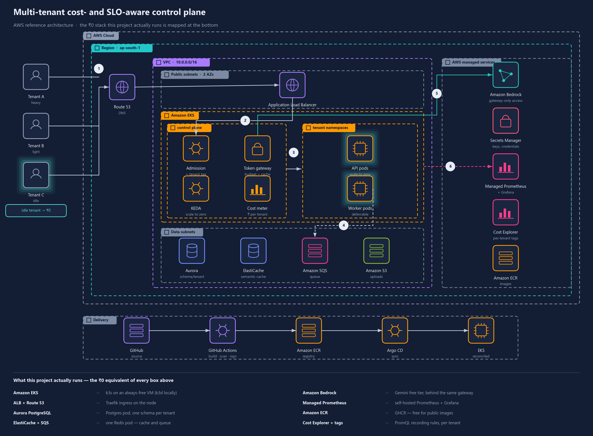

<div align="center">

# Multi-tenant SaaS on Kubernetes

### A cost- and SLO-aware multi-tenant control plane for LLM-backed applications on Kubernetes.

**Scale each tenant to zero when idle. Cap what any tenant can spend on model tokens. Keep one customer's batch job from slowing another customer's request. Then put a rupee figure on every tenant.**

<p>
  
  
  
  
  
  
</p>



<sub><b>Target architecture on AWS.</b> The panel at the bottom of the diagram maps every managed service to the zero-cost component this project actually runs.</sub>

</div>

---

> **Status — in development.** Built as the laboratory project for Cloud Computing Methodologies at VIT Vellore. The
> repository is public from day one so the work is visible as it happens. Results tables below are empty until the
> experiments in `experiments/` have actually been run — nothing here is claimed before it is measured.

## The problem

A web application serving several customers from one deployment has a cost structure container orchestration was not
designed for:

| # | Problem | Why the platform does not solve it |
| --- | --- | --- |
| **P1** | An idle tenant still costs money — every service stays resident whether the customer logs in or not. | A Kubernetes `Deployment` has a floor of one replica, and nothing in the default scheduler knows a tenant has had no traffic for eleven hours. |
| **P2** | Model tokens dominate operating cost, and no tenant has a ceiling. | Periodic agent scans re-ask near-identical questions on a timer. Nothing de-duplicates semantically equivalent prompts, and nothing stops one tenant consuming the entire budget. |
| **P3** | One tenant's batch job slows another tenant's interactive request. | Both are ordinary pods competing for the same CPU. Kubernetes has no notion that one has a user waiting and the other does not. |

## The control plane

Five stages in the request path, and deliberately nothing else:

1. **Admission** — stamps every request with a tenant id and a latency class (`interactive` or `deferrable`).
2. **Token gateway** — the only route to the model. Checks the tenant's remaining budget, serves semantically
   equivalent prompts from a vector cache, and coalesces periodic scans into batched calls.
3. **Elasticity** — drives KEDA from HTTP activity and queue depth, so a tenant with no traffic holds no pods.
4. **Fair scheduling** — priority classes, so deferrable work yields rather than competing.
5. **Cost meter** — joins CPU-seconds, tokens and stored bytes into one rupee figure per tenant per month.

## Claims this repository sets out to demonstrate

| | Claim | Evidence |
| --- | --- | --- |
| **C1** | Scale-to-zero reduces a tenant's idle cost to approximately zero, at a bounded and measurable cold-start penalty. | _pending_ |
| **C2** | Per-tenant token budgets, semantic caching and scan batching cut model spend substantially, with no loss of answer quality on a fixed question set. | _pending_ |
| **C3** | Class separation holds the interactive latency objective under heavy batch load, and cost per tenant falls with tenant density up to a locatable limit. | _pending_ |

## Results

Regenerated from raw run data by `make report`. Empty until the experiment campaign runs.

| Metric | Baseline (one deployment per tenant) | With the control plane |
| --- | --- | --- |
| ₹ per tenant per month | _pending_ | _pending_ |
| Idle cost per tenant | _pending_ | _pending_ |
| Cold-start p95 | — | _pending_ |
| Token spend per tenant | _pending_ | _pending_ |
| Semantic cache hit rate | — | _pending_ |
| Interactive p95 under batch load | _pending_ | _pending_ |
| Tenants per node at SLO | _pending_ | _pending_ |

## Repository layout

```text
workload/          the demonstration application - deliberately small, frozen once it works
  api/             FastAPI: /summary (cheap read), /ask (LLM), /analyze (enqueue)
  worker/          queue consumer running a CPU-bound job of tunable size
controlplane/      the actual deliverable
  admission.py     tenant id + latency-class tagging middleware
  gateway/         token budget, semantic cache, prompt coalescing
  costmeter/       PromQL recording rules -> rupees per tenant
  scaler/          KEDA ScaledObjects and HTTP add-on configuration
deploy/
  charts/          Helm chart, one release per tenant
  k8s/             PriorityClasses, ResourceQuotas, NetworkPolicies
  terraform/       free-tier VM + k3s bootstrap
  argocd/          Application definitions
experiments/
  tenants.py       tenant population and shift-shaped load model
  questions.yaml   fixed question set used to validate cache answer quality
  run.py           configuration x repeat runner (E1-E7)
  raw/             committed raw run output - the evidence behind every figure
  figures.py       regenerates every figure from raw/
```

## Running it

Requires Docker, `kubectl`, `k3d`, `helm` and Python 3.12. Nothing in this project needs a cloud account or a
payment method.

```bash
make up          # k3d cluster + workload + Prometheus/Grafana
make load        # drive the shift-shaped multi-tenant workload
make experiment  # run the E1-E7 matrix into experiments/raw/
make report      # regenerate every figure from raw data
make down        # destroy the cluster
```

## Why it runs on nothing

| Managed service | What this project runs instead |
| --- | --- |
| Amazon EKS | k3s on an always-free VM, k3d locally |
| ALB + Route 53 | Traefik ingress on the node |
| Aurora PostgreSQL | Postgres pod, one schema per tenant |
| ElastiCache + SQS | one Redis pod — cache and queue |
| Amazon Bedrock | Gemini free tier, behind the same gateway |
| Managed Prometheus / Grafana | self-hosted Prometheus + Grafana |
| Amazon ECR | GHCR, free for public images |
| Cost Explorer + allocation tags | PromQL recording rules, per tenant |

The AWS diagram above is the **target** architecture, not deployed infrastructure. Everything measured in this
repository runs on the right-hand column.

## Motivation

The three problems above were found in a real system: [Quality-AI-Intelligence](https://github.com/krizz711/Quality-AI-Intelligence),
a multi-agent manufacturing quality platform that ships as a twelve-service Docker Compose stack, re-analyses every
active measurement series through a language model every thirty seconds, and runs CPU-heavy gauge studies alongside
an interactive dashboard. Pointing this control plane at it is future work — deliberately, so that no result here
depends on migrating a large application first.

## Licence

MIT — see [LICENSE](LICENSE).
